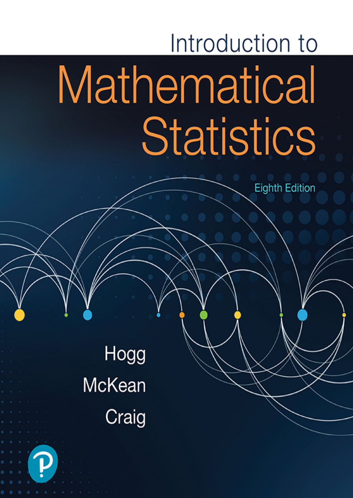

# Mathematical Statistics — Notes 📘

Welcome to this repository containing my handwritten iPad notes from working through the book **Mathematical Statistics**. These notes are organized by chapter and reflect my learning journey, insights, and worked examples from the book. The goal is to reinforce understanding through visual explanations and to provide a useful reference for myself and others studying the same material.

## 📖 Book Reference

  

**Title**: *Mathematical Statistics*  
**Author**: [Hogg, McKean, Craig]  
**Edition**: [8th Edition]  
**Publisher**: [Pearson Education]

---

## 📂 Repository Structure

- `images/`
  - `MathStatsHogg.png` — Book cover image for the README
- `notes/`
  - `Chapter 1.2.pdf` — Notes for Chapter 1.2
  - `Chapter 1.2 Exercises.pdf` —  My attempt on the exercises for Chapter 1.2
  - `chapter 1.3.pdf` — Notes for Chapter 1.3
  - `...` — More chapters as you go
- `README.md` — This file
